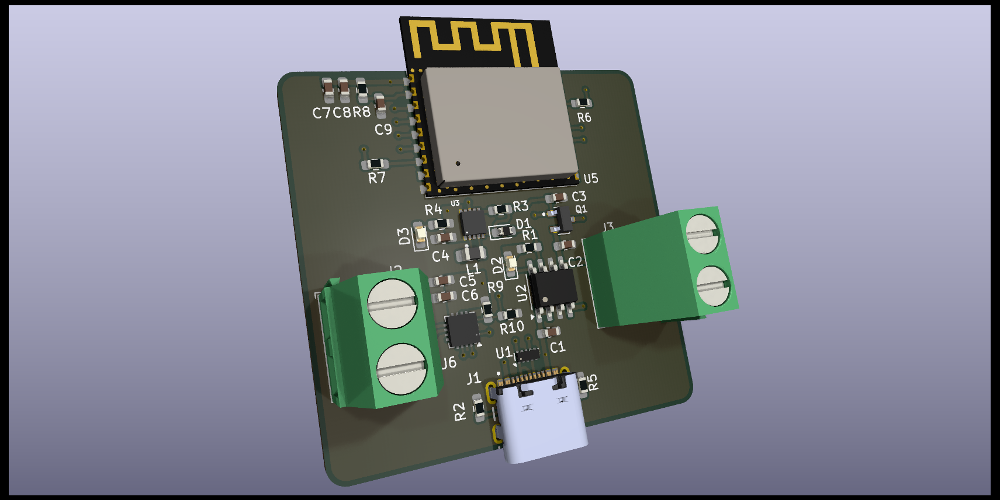

# Bluetooth-Speaker 🛜🔊
 PCB design for a custom bluetooth speaker

    

<i>KiCad Render</i>

## Design Considerations
The goal of this project was to design a simple Bluetooth speaker using parts I already had at home, along with components available in the current KiCad library. This approach aimed to simplify the design process.
Based on the above goal I selected the following components: 

# Components

## ESP32 🖥️
* [ESP32-C3-WROOM-02](https://www.espressif.com/en/module/esp32-c3-wroom-02-en)
* I settled on this ESP32 module because it included the following essential features for this project:
    * Bluetooth 5
    * On-board PCB antenna
    * I2S (Inter-Integrated Circuit Sound)
    * Built-in USB Serial/JTAG Controller
* During my initial research, I planned to use the GPIO DACs to output the audio signal. However, I soon discovered that other models only offered 8-bit DACs, which were insufficient for modern audio quality. As a result, I decided to settle on a chip that supported I2S.
* Lastly, many ESP32 models require a USB to UART chip for programming. I chose this particular model because it has this functionality built in, allowing it to be directly wired to the USB port.

## Lithium Ion Battery 🔋
For the battery, I ended up selecting a pair of lithium-ion batteries I already had at home. The batteries were two 3.7V 2600mAh lithium-ion batteries from PKCELL. The batteries were initially going to be arranged in series in a battery pack to produce an output voltage of 7.4V and a capacity of 2600 mAh. However, after further research, I determined that using a single cell outputting 3.7V would significantly simplify the design. [Li-ion Battery ICR18650 2600mAh 3.7V Datasheet](https://www.parts-express.com/pedocs/specs/142-202--pkcell-flat-top-18650-li-ion-3.7v-2600mah-rechargeable-battery-spec-sheet.pdf). Some important specifications to note about this battery are the following:
* Nominal Voltage - 3.7V
* Charging Cut-off Voltage - 4.2V
* Discharge Cut-off Voltage - 3.0V
* Standard Charge - Constant Current 0.5C Constant Voltage 4.2V 0.01 C cut-off
* Standard Discharge - Discharge at 0.2 C to 3.0V

    

<i>PKCELL Lithium Ion Batteries</i>

## Audio Amplifier 
The audio amplifier was a key factor in determining my lithium-ion battery cell configuration. When selecting an amplifier, I had several requirements:
* It needed to output 2-5 watts with a 4-ohm speaker.
* It had to have built-in support for I2S to simplify the external circuitry.
* It required a low enough supply voltage to be compatible with either a 1S or 2S lithium-ion battery configuration.
Given these requirements, I opted for a Class D amplifier. These amplifiers are the most efficient, requiring the lowest supply voltage, which made them ideal for my battery-powered application.

### Power Considerations
* For Class D audio amplifiers under 5 watts, you can power them with a single 18650 3.7V cell, as they typically operate within a voltage range of 2.5 to 5.5V.
* For Class D audio amplifiers exceeding 5 watts, a higher supply voltage range is necessary, which typically requires a larger series battery configuration. However, when your battery configuration's supply voltage surpasses 5V, standard USB-C charging becomes insufficient. In this case, you have two options:
    1. Use a power delivery IC to negotiate higher voltages (9V, 12V, or 20V) from the wall socket.
    2. Implement a boost converter between the USB-C receptacle and the charger management IC.

I ended up settling on the [MAX98357A](https://www.analog.com/media/en/technical-documentation/data-sheets/MAX98357A-MAX98357B.pdf). Some important specifications to note about this battery are the following:
* Single-Supply Operation (2.5V to 5.5V)
* 3.2W Output Power into 4Ω at 5V
* Supports I2S data

## Charger Management IC
For the charger management IC I ended up settling on the [MAX1811](https://www.analog.com/media/en/technical-documentation/data-sheets/MAX1811.pdf) because of its simplicity and due to the fact it was already in the KiCad library.

# Firmware

# Schematic Design
## USB-C
For the USB-C interface, I opted for a minimal power delivery interface and simply added 5.1k pull-down resistors on both CC lines. Consequently, with a compatible power source (host), this device should be able to draw up to 3A of current.

## MAX1811 (Charging Management IC)
* Battery Regulation Voltage-Select Input was set to high so that the battery regulation set point is 4.20V
* Battery Regulation Current-Selection Input was set to high to default to a 500mA maximum battery regulation current.
    * This charger IC is on the slower side. There exists much higher power charger management IC'selected

## RT6150B-33GQW (Current Mode Buck-Boost Converter)
* The RT6150A/B is a high efficiency, fixed frequency, BuckBoost DC-DC converter that operates from input voltages above, below or equal to the output voltage.

### Inductor Selection
* ${L_1=\frac{V_{out}\cdot \left(V_{in\left(max\right)}-V_{out}\right)}{f\cdot ΔI_L\cdot V_{out}}=\frac{3.3\cdot \:\left(5-3.3\right)}{1E6\cdot 0.15\cdot \:3.3} = 7.48uH}$
* ${L_2=\frac{V_{in\left(min\right)}\cdot \:\left(V_{out}-V_{in\left(min\right)}\right)}{f\cdot \:ΔI_L\cdot \:V_{out}}=\frac{3.1\cdot \:\:\left(3.3-3.1\right)}{1E6\cdot \:0.150\cdot \:\:3.3}=1.25uH}$
* ${ΔI_L}$ The ripple current was chosen to be 30% of the suggested ESP32 power supply output current of at least 500mA.
* The datasheet suggests <i>"The recommended inductor value range is between 1.5μH and 4.7μH."</i>
* Therefore, based on the datasheets suggestions and calculations a reasonable middle ground was to select an inductance of 4.7uH.

### Output Capacitor Selection
* ${ΔV_{out},\:peak\:\left(Buck\right)=100mV=\frac{V_{out}\cdot \:\left(V_{in}-V_{out}\right)}{V_{in}\cdot \:8\cdot \:L\cdot \:\left(f_{osc}\right)^2\cdot \:C_{out}}=\frac{3.3\cdot \:\left(5-3.3\right)}{5\cdot \:8\cdot \:\left(4.7E-6\right)\cdot \:\left(1E6\right)^2\cdot \:C_{out}}\rightarrow C_{out}=2.98E-7F}$
* ${ΔV_{out},\:peak\:\left(Boost\right)=100mV=\frac{I_{Load}\cdot \left(V_{out}-V_{in}\right)}{C_{out}\cdot V_{out}\cdot f_{osc}}=\frac{0.5\:\cdot \:\left(3.3-3.1\right)}{C_{out}\cdot \:3.3\cdot \:\left(1E6\right)}\rightarrow C_{out}=3.03E-7F}$
* The above calculations assume an output ripple voltage of 100mV. Given that said we will use the value that is used on the Raspberry Pi PICO (47uF) which is significantly higher and will result in a significantly smaller output ripple voltage.

### Thermal Considerations
* PD(MAX) = (125°C − 25°C) / (30.5°C/W) = 3.28W for
WDFN-10L 3x3 package

* PD(MAX) = (125°C − 25°C) / (40.9°C/W) = 2.44W for
WDFN-10L 2.5x2.5 package 

# PCB Layout

# BOM

# Characterization

# Resources
* [How to design an ESP32 PCB with KiCad (in less than 25 minutes)
](https://www.youtube.com/watch?v=jiJGbWOSdMo)
* [ESP32 + PCB Antenna Hardware Design Tutorial - Phil's Lab #90
](https://www.youtube.com/watch?v=yxU_Kw2de08)
* [ESP32 PCB Layout Design](https://docs.espressif.com/projects/esp-hardware-design-guidelines/en/latest/esp32c2/pcb-layout-design.html)
* [All About USB-C: Example Circuits
](https://hackaday.com/2023/08/07/all-about-usb-c-example-circuits/)
* [ESP32 Dev Kit Schematic Example](https://dl.espressif.com/dl/schematics/SCH_ESP32-C3-DEVKITC-02_V1_1_20210126A.pdf)
* [I2S MAX98357 Bluetooth Speaker project for ESP32 microcontroller / Programming Arduino IDE](https://www.youtube.com/watch?v=24pk28oqVQI)
* [ESP32 Audio Output with I2S DMA and the MAX98357A Class D Amplifier](https://www.youtube.com/watch?v=At8PDQ3g7FQ)
* [ESP32-A2DP](https://github.com/pschatzmann/ESP32-A2DP)
* [ESP32 DAC Audio Analog Output With Examples (Arduino IDE)](https://deepbluembedded.com/esp32-dac-audio-arduino-examples/)
* [Sound with ESP32 – I2S Protocol](https://dronebotworkshop.com/esp32-i2s/)