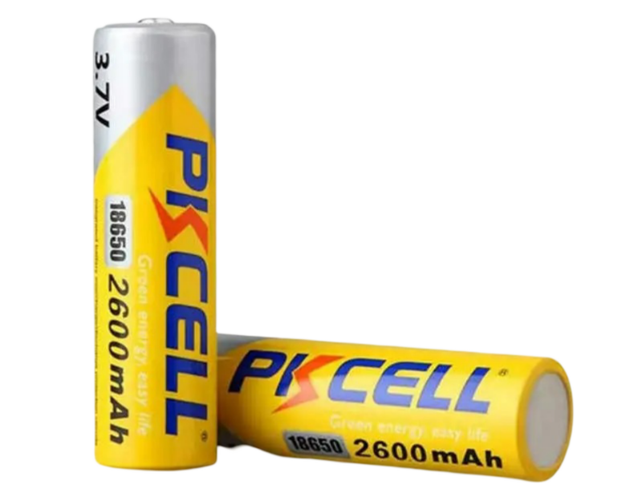

# Bluetooth-Speaker 🛜🔊
 PCB design for a custom bluetooth speaker

## Design Considerations
The goal of this project was to design a simple Bluetooth speaker using parts I already had at home, along with components available in the current KiCad library. This approach aimed to simplify the design process.
Based on the above goal I selected the following components: 

# Components

## ESP32 🖥️
* [ESP32-C3-WROOM-02](https://www.espressif.com/en/module/esp32-c3-wroom-02-en)
* I settled on this ESP32 module because it included the following essential features for this project:
    * Bluetooth 5
    * On-board PCB antenna
    * I2S (Inter-Integrated Circuit Sound)
    * Built-in USB Serial/JTAG Controller
* During my initial research, I planned to use the GPIO DACs to output the audio signal. However, I soon discovered that other models only offered 8-bit DACs, which were insufficient for modern audio quality. As a result, I decided to settle on a chip that supported I2S.
* Lastly, many ESP32 models require a USB to UART chip for programming. I chose this particular model because it has this functionality built in, allowing it to be directly wired to the USB port.

## Lithium Ion Battery 🔋
For the battery, I ended up selecting a pair of lithium-ion batteries I already had at home. The batteries were two 3.7V 2600mAh lithium-ion batteries from PKCELL. The batteries were initially going to be arranged in series in a battery pack to produce an output voltage of 7.4V and a capacity of 2600 mAh. However, after further research, I determined that using a single cell outputting 3.7V would significantly simplify the design. [Li-ion Battery ICR18650 2600mAh 3.7V Datasheet](https://www.parts-express.com/pedocs/specs/142-202--pkcell-flat-top-18650-li-ion-3.7v-2600mah-rechargeable-battery-spec-sheet.pdf). Some important specifications to note about this battery are the following:
* Nominal Voltage - 3.7V
* Charging Cut-off Voltage - 4.2V
* Discharge Cut-off Voltage - 3.0V
* Standard Charge - Constant Current 0.5C Constant Voltage 4.2V 0.01 C cut-off
* Standard Discharge - Discharge at 0.2 C to 3.0V

    

<i>PKCELL Lithium Ion Batteries</i>

## Audio Amplifier 
The audio amplifier was a key factor in determining my lithium-ion battery cell configuration. When selecting an amplifier, I had several requirements:
* It needed to output 2-5 watts with a 4-ohm speaker.
* It had to have built-in support for I2S to simplify the external circuitry.
* It required a low enough supply voltage to be compatible with either a 1S or 2S lithium-ion battery configuration.
Given these requirements, I opted for a Class D amplifier. These amplifiers are the most efficient, requiring the lowest supply voltage, which made them ideal for my battery-powered application.

### Power Considerations
* For Class D audio amplifiers under 5 watts, you can power them with a single 18650 3.7V cell, as they typically operate within a voltage range of 2.5 to 5.5V.
* For Class D audio amplifiers exceeding 5 watts, a higher supply voltage range is necessary, which typically requires a larger series battery configuration. However, when your battery configuration's supply voltage surpasses 5V, standard USB-C charging becomes insufficient. In this case, you have two options:
    1. Use a power delivery IC to negotiate higher voltages (9V, 12V, or 20V) from the wall socket.
    2. Implement a boost converter between the USB-C receptacle and the charger management IC.

I ended up settling on the [MAX98357A](https://www.analog.com/media/en/technical-documentation/data-sheets/MAX98357A-MAX98357B.pdf). Some important specifications to note about this battery are the following:
* Single-Supply Operation (2.5V to 5.5V)
* 3.2W Output Power into 4Ω at 5V
* Supports I2S data

## Charger Management IC
For the charger management IC I ended up settling on the [MAX1811](https://www.analog.com/media/en/technical-documentation/data-sheets/MAX1811.pdf) because of its simplicity and due to the fact it was already in the KiCad library.

# Firmware

# Schematic Design

# PCB Layout

# Characterization
